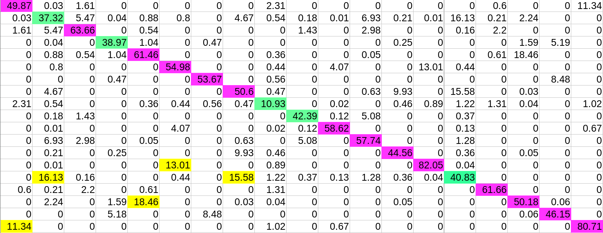

```{r include=FALSE, echo=FALSE, eval=TRUE}
library(knitr)
#library(kableExtra)
# library(formattable)
options(width = 300)
# options(encoding = 'UTF-8')
knitr::opts_chunk$set(
  fig.width = 7, fig.height = 5, 
  fig.path = 'figures/suivi_',
  fig.align = "center", 
  size = "tiny", 
  echo = TRUE, eval = TRUE, 
  warning = FALSE, message = FALSE, 
  results = TRUE, comment = "")
options(scipen = 12) ## Max number of digits for non-scientific notation
# knitr::asis_output("\\footnotesize")
```


# Objectif du projet

Le but du projet est d'étudier les différents sites de liaison de la protéase du VIH-2 (PR2) dans le but d'identifier de nouveau site de liaison


# Data disponibles 

* le répertoire `data/PR2_19` contient les fichiers PDB des 19 structures de PR2 disponibles dans la PDB.


# Protocole

* Estimation des poches des 19 PR2 à l'aide de Fpocket  
    + étape 1 : A l'aide du programme Fpocket, identifier toutes les poches des 19 PR2. 
    + étape 2 : calcul du score de druggabilité de chaque poche à l'aide du logiciel PockDrug.  
    + étape 3 : calcul du chevauchement entre toutes les poches, pour identifier les poches similaires des différentes protéines.  

* Estimation des poches des 19 PR2 à l'aide de FTMap  
    + étape 1 : A l'aide du programme FTMap, identifier toutes les poches des 19 PR2. 
    + étape 2 : comparer les résultats avec les poches obtenues avec Fpocket
    
* Classification des poches basées sur leur description  
    + étape 1 : calculer les descripteurs de différentes poches estimées
    + étape 2 : classification des poches

* Selection des poches d'intérêt

* Etude des interactions entre les résidus de ces poches et les autres résidus des PR2.


#04/03/2019 


# Estimation des poches

- faite en utilisant le programme fpocket.

- Génération du programme `/home/hecini/Research/stage_HECINI/data/PR2_19/fpocket.sh` pour lancer l'estimation des poches sur les 19 PR2.

- les fichiers output se trouvent dans :  `/home/hecini/Research/stage_HECINI/data/PR2_19/pockets`

- Génération du programme copier_coller.sh `/home/hecini/Research/stage_HECINI/data/PR2_19/pockets/copier_coller.sh`  qui permet mettre les pockets et le fichier pdb en question dans un seul dossier. 

- Visualisation des pockets via pymol. pour chaque protèine il y'a une session *.pse qui a été sauvegardé afin de revoir les résultats facilement. 

# Dénombrement des poches par protéine

fait manuellement

[résultats](pdf/nombre_poches.pdf)

pdb | poche | poche prin |
----|-------|------------|
1HSI|   2   |    0       |
1HSI|   2   |    0       |
1HII| 5     |            |
1JLD|10     |            |
1IDB|9      |            | 
2HPE|11 ?   |            |
3EC0|9 0    |            |
4UPJ|6      | 0 et 1     |
1HSH|7      |0 et 2     |
1IVP|9 
3ECG| 11| 0|
5UPJ| 6| 0|
1HSI| 10| //|
1IVQ |7| 0|
2MIP |7 ||
3S45 |10 |0 et 1
6UPJ |6 | 0 1 et 8
1IDA |5 | 0 1 et 2
3EBZ |10 |0|
3UPJ |7 |0

# Le 05/03/2019 et le 06/03/19 

#Création de : 

    --> Pockets qui contient les fichiers pdb des poches. Les fichier pdb ont été renomés en utilisant 
        un script bash rename.sh
        
    --> proteins : qui contient les 19 strcutures renomées avec rename.sh
    
    -->rename.sh est modifié selon le fichier que l'on souhaite renomer. 
    
  
#Calcul des scores et analyse de données 

- Développer un programme python pour calculer les scores de similarité entre les poches
    [score_v2.py](script/score_v2.py) 
- génération d'un fichier [scores.csv](script/score.csv) 
- Préparation du fichier csv  avec R pour analyser les données:

    --> diviser la 1ere colonne en deux pour séparer les noms des poches
    
    --> Transformation du dataFrame en Matrix numérique 
    
    --> générer un pheatmap
  
  En utilisant [ ce script.R ](script/scores_analysis.R) 
  


  
  
#Bibliotheque :

  lecture de "Damm KL, Ung PM, Quintero JJ, Gestwicki JE, Carlson HA. A poke in the eye: inhibiting HIV-1 protease through its flap-recognition pocket. Biopolymers. 200889:643-52"

#07/03/19 

- Classification des poches suivant leur descriptions ( kmeans et Hclust + méthode d'optimisation de nombre de clusters + visualisation avec ACP)

- le script R utilisé est [classification.R](script/classification.R)

- Développement d'un algorithme python qui permet de calculer le barycentre d'un ensemble de PDB dans un répertorie donnée et génération d'un fichier csv contenant 4 colonnes : le nom de pdb, les coordonées de barycentres x, y et z
[cliquez ici pour voir le code python](script/positionnement.py). je modifie le code demain pour qu'ils calcule ces distances entre les structures de PR2 et pas les poches. 

- Classification des poches suivant leur localisation 3D. Pour cela un script R appellé [Positionnement3D](script/positionnemnt3D.R) a été utilisé oû j'ai calculé la distance entre chaque poches et 1HSI0 (FAUDRAIT QUE JE FASSE ÇA POUR 1HSI et pas les poches de 1HSI) => à modifier pour demain 

- J'ai commencé la comparaison des deux classifications obtenues 

- aucune rédation n'a été commencée 

#13/03/19 

- Recommencer la determination des poches avec fpocket 
- J'ai refait le calcul des scores de similarité entre les poches 
- Analyser les scores 
- Classification 

  

la figure là haut a été générée en utilisant le code appelé [bar_colored.R](script/bar_colored.R)

# 2 méthodes de détermination du nombre de clusters 

1) Premiere méthode (la méthode des moindre carrées) :  diviser l'arbre à plusieurs Hauteurs différentes 

  - génération des clusters
  
  - calculer le score moyen par cluster 
  
  - calculer le score moyen général ( la moyenne des scores moyen ) 
  
  le nombre de cluster le plus intéressant est celui qui permet d'obtenir des scores moyens trés proches de score moyen général. On calcul une valeur noté y. plus Y est petit plus la velur de H est intéressante 
  
  - visualisation avec Pymol pour etre sur qu'il s'agit des poches différentes 
  
  cette méthode est réalisé dans (script/scores_analysis.R) 

2) Deuxieme méthode 
- couper l'arbre à plusieurs hauteurs 
- génération des clusters 
- calculer la similarité entre les clusters 
- création des matrices avec des scores de similarité entre les clusters 
- ploter la somme des scores (seulement la semi matrice sans la diag) en fonction du nombre de cluster 
- La valeur de H la plus intéressante est celle qui permet d'obtenir un score faible (MAIS DES VALEURS DE DIAG IMPORTANTE AUSSI)

- cette méthode est réalisé par le code [score_inter.R](script/score_inter.R)

  
  
#14/03/2019 

- Continuer à travailler sur le clustering. 


- Analyse des graphiques et l'analyse des 20 fichiers CSV générés, Je trouvais que les 3 Hauteurs les plus intéressantes sont les suivantes : 





- Vert : des valeurs faibles 
- Violet : des valeurs bonnes
- Jaune : des valeurs importantes que l'on souhaite réduire 


Au final j'ai décidé de travaillé avec H = 1.6 

- J'ai commencé la detection des poches representatives 

```{r}
pdb <- c("1HSI", "3S45")
nbr.pocket <- c(10,15)
```

- etudier la repartition du nombre de poches par protéine.


